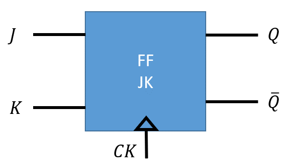
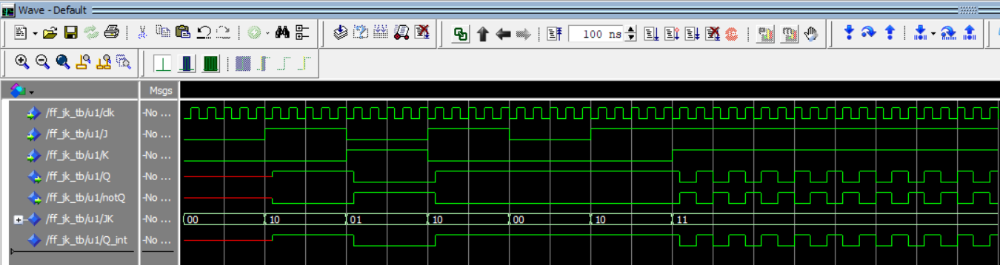

## **Descripción y funcionamiento de un biestable JK.**

El funcionamiento del biestable JK cuyo símbolo representado en la Figura 1  se encuentra descrito por la siguiente tabla de verdad. 



| J | K  | Q  | notQ |
|:--:|:--:|:--:|:--:|
| 0 | 0 | Q | notQ |
| 0 | 1 | 0 | 1 | 
| 1 | 0 | 1 | 0 | 
| 1 | 1 | notQ | Q |

A diferencia de lo que ocurre en el biestable SR, el cual tiene como estado prohibido que ambras entradas (*S*, y *R*) tomen valor *'1'* en el biestable JK sus entradas  *J* y *K* si pueden tomar valor *'1'* de forma simultanea sin que se produzca ninguna indeterminar. En este modo de trabajo el biestable pasa a trabajar en modo basculación, es decir, sus salidas van a cambiar de valor cada vez que llegue un flanco activo de reloj. pasando de *'0'* a *'1'* o de *'1'* a *'0'* según sea el estado de la salida en el instante de la llegada del flanco.

Este funcionamiento se describe en el siguiente código VHDL. 

```VHDL
llibrary IEEE;
use IEEE.std_logic_1164.all;
use IEEE.numeric_std.all;

entity FF_JK is
    port(
        clk, J, K: in std_logic;
        Q, notQ: out std_logic
    );
end entity FF_JK;

architecture rtl of FF_JK is
    signal JK: std_logic_vector(1 downto 0);
    signal Q_int: std_logic;
begin
    JK <= J&K;
    process(clk)
    begin
        if (clk = '1' and clk'event) then
            case JK is
                when "00" => Q_int <= Q_int;
                when "01" => Q_int <= '0';
                when "10" => Q_int <= '1';
                when others => Q_int <= not Q_int;
            end case;
        end if;
    end process;
    Q <= Q_int;
    notQ <= not(Q_int);

end architecture rtl;
```

Es interesante resaltar la instrucción ***JK <= J&K;*** ya que esta permite concatenar los valores de entrada de *J* y *K* para trabajarlos posterioremente como un vector a través de la señal *JK*.

También observamos que internamente solo se ha utilizado un valor de *Q_int* para la realimentación de la salida del biestable puesto que para describir el funcionamiento no es neceario realimentar las dos salidas *Q* y *notQ*. Unicamente es necesario dar valor a las salida de ambas como se hace con las instrucciones:
```VHDL
    Q <= Q_int;
    notQ <= not(Q_int);
```
A continuación se muestra el desarrollo del código para el banco de pruebas, ***test bench***, que permite proporcionar a las entradas los estímulos necesarios para que las salidas cambien y se pueda verificar el funcionamiento del biestable JK

```VHDL
library IEEE;
use IEEE.std_logic_1164.all;
use IEEE.numeric_std.all;

entity FF_JK_tb is
end entity FF_JK_tb;

architecture rtl of FF_JK_tb is
    
    signal J : std_logic:= '0';
    signal K : std_logic:= '0';
    signal clk : std_logic:= '0';
    signal Q : std_logic:= '0';
    signal notQ : std_logic:= '1';

    component FF_JK is
        port(
            clk, J, K: in std_logic;
            Q, notQ: out std_logic
        );
    end component FF_JK;
    
begin
    u1: FF_JK
    port map
    (
        clk => clk,
        J => J,
        K => K,
        Q => Q,
        notQ => notQ
    );  
    
    clk <= NOT clk AFTER 1 ns;
    
    testbech: process
    begin
        J <= '0';       K <= '0';
        wait for 10 ns;
        J <= '1';       K <= '0';
        wait for 10 ns;
        J <= '0';       K <= '1';
        wait for 10 ns;
        J <= '1';       K <= '0';
        wait for 10 ns;
        J <= '0';       K <= '0';
        wait for 10 ns;
        J <= '1';       K <= '0';
        wait for 10 ns;
        J <= '1';       K <= '1';
        wait;     
    end process testbech;
end architecture rtl;
```

La Figura 2 muestra el restultado de la simulación  del biestabla JK. En la simulación se muestran todos los valores, tanto de señales internas como la señal que corresponde a la concatenación de las entradas *J* y *K*.



&copy; Diego Antolín Cañada