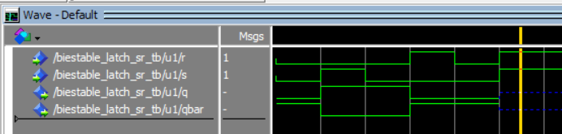

## **Descripción y funcionamiento de un biestable SR.**

El funcionamiento del biestable RS o SR cuyo símbolo representado en la Figura 1.

Su funcionamiento se encuentra descrito por la siguiente tabla de verdad. 

| r | s  | q  | qbar |
|:--:|:--:|:--:|:--:|
| 0 | 0 | q | qbar |
| 0 | 1 | 1 | 0 | 
| 1 | 0 | 0 | 1 | 
| 1 | 1 | X | X |


Como se puede observar en la tabla cuando las entradas S y R toman valor *'1'*, las salidas  *q* y *qbar* (esta última hace referencia a ***q*** negada) tienen como valor una *X*, ya que la situción de querar marcar y borrar el biestable al mismo tiempo no tiene sentido. Aunque es cierto que podemos implementar circuitos que den prioridad al borrado o al marcado según como se desarrolle la implementación.

El siguiente código *VHDL* hace una descripción del funcioamiento utilizando un proceso con su correspondiente lista de sensibilidad. El desarrollo de la descripción esta basada en al descripción del comportamiento del biestable. 

Con el fin de mostrar el efecto del estado *"prohibido"*, donde *s* y *r* valen *'1'*, como una indeterminación; la descripción se ha desarrollando otorgando en esas condiciones como valor a la salida *'-'*. *'**-**'* es el valor que representa la indeterminación para un tipo de dato *std_logic*.

Si observamos el código, falta el caso en que *s* y *r* valen *'0'*. En este caso, el valor de *q* y *qbar* se queda como está. Al estar descrito en un proceso, solo se han contemplado las situaciones que llevan a cambiar el valor de las salidas.


```VHDL
library IEEE;
use IEEE.std_logic_1164.all;
use IEEE.numeric_std.all;

entity biestable_latch_sr is
    port(
        r, s : in     std_logic;
        q : out std_logic:= '0';
        qbar : out std_logic:= '1'
    );
end entity biestable_latch_sr;

architecture rtl of biestable_latch_sr is
   
begin
    rs: process(r,s)
    begin
        if ((r='0') and (s ='1')) then
            q <= '1';
            qbar <= '0';
        elsif ((r='1') and (s ='0')) then
            q <= '0';
            qbar <= '1';
        elsif ((r='1') and (s ='1')) then
            q <= '-';
            qbar <= '-';
        end if;
    end process rs;

end architecture rtl;
```
Posteriormente se mostrará el funciomaniento de esta descripción utilizando el correspondiente ***Test Bench***, pero se prefiere a continuación mostrar otra descripción basada en el circuito del biestable SR con puertas lógicas con marcado prioritario que se implementa con puertas NAND y que se muestra en la Figura 2. 

Como se puede ver en la descripción cuando la sentencia: ***q_int <= s nand qbar_int;*** hace que ***q_int*** (siendo esta la señal/cable de realimentación) y posteriormetne *q* pasen a valen *'1'*. De forma similar, cuando ***qbar_int <= r nand q_int;*** hacen que *qbar_int* valga '*1'* cuando se cumple la condición.

Se puede destacar el uso de las señales como elementos de carácter interno (*q_int* y *qbar_int*) en el circuito para permitir la realimentación de las salidas, llevandolas a las entradas de las puertas lógicas.

```VHDL
library IEEE;
use IEEE.std_logic_1164.all;
use IEEE.numeric_std.all;

entity biestable_latch_sr is
    port ( s, r: in std_logic;
        q, qbar: out std_logic);
end biestable_latch_sr;

architecture rtl of biestable_latch_sr is
    signal q_int, qbar_int : std_logic;
begin
    q_int <= s nand qbar_int;
    qbar_int <= r nand q_int;
    q <= q_int;
    qbar <= qbar_int;
end architecture rtl;
```

Finalmente, para poder simular es neceasrio desarrollar el código del ***Test Bench*** que permita proporcionar a las entradas (los estímulos) necesarios para que las salidas cambien y podamos comprobar el funcionamiento de los componentes descritos.

Dicho de otro modo, el banco de ensayos ***Test Bench*** debe proporcionar los estímulos a las entradas para poder comprobar el funcionamiento del componente descrito en VHDL. El siguiente código permite simular y verificar el circuito del **biestable SR** descrito de las dos formas anteriores.

```VHDL
library IEEE;
use IEEE.std_logic_1164.all;
use IEEE.numeric_std.all;

entity biestable_latch_sr_tb is
end entity biestable_latch_sr_tb;

architecture rtl of biestable_latch_sr_tb is
    
    signal r,s : std_logic;
    signal q, qbar : std_logic;
    
    component biestable_latch_sr is
        port(
            r, s : in     std_logic;
            q : out std_logic := '0';
            qbar : out std_logic:= '1'
        );
    end component biestable_latch_sr;
    
begin
    u1: biestable_latch_sr
    port map
    (
        r => r,
        s => s,
        q => q,
        qbar => qbar
    );
    
    sim: process
    begin
        r <= '0';       s <= '0';
        wait for 10 ns;
        r <= '0';        s <= '1';
        wait for 10 ns;
        r <= '0';        s <= '0';
        wait for 10 ns;
        r <= '1';        s <= '0';
        wait for 10 ns;
        r <= '0';        s <= '0';
        wait for 10 ns;
        r <= '1';        s <= '1';
        wait;
    end process sim;

end architecture rtl;
```

La Figura 3 muestra el restultado de la simulación de la primera descripción del biestabla RS considerando como valor indeterminado en la salida al existir un valor *'1'* en ambas entradas, *r* y *s*.


Simulando la segunda descripción del hardware tratado en este documento, se obtienen los resultados de simulación mostrados en le Figura 4. El banco de trabajo (***Test Bench***) utilizado es el mismo que en el caso anterior. 


Comparando ambas simulaciones podemos ver las diferencias y similitudes existentes entre ambas descripciones. Funcionalmente son muy similares, la diferencia se encuentra en la situación en que ambas entradas del biestable  tienen un nivel alto. 

En estas condiciones, la primera descripción produce como resultado una salida indeterminada, es decir, *'-'*. Mientras que en la segunda se pueden ver los resultados de las salidas intermedias, lo que permite ver fácilmente el comportamiento del biestable sr y su efecto de marcado prioritario.

&copy; Diego Antolín Cañada