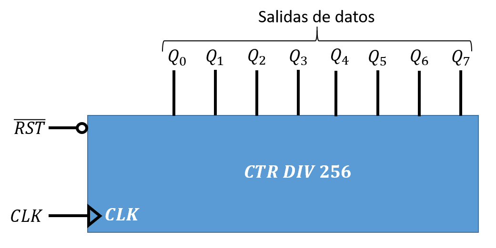
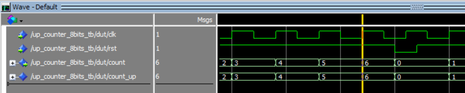
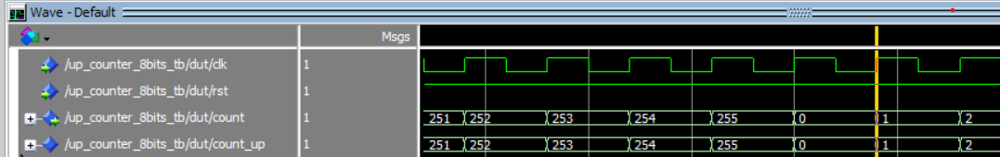

## **Descripción y funcionamiento de un contador módulo 256 con reset asíncrono.**

El contador módulo 256 de la Figura 1 cuenta valores desde 0 hasta 255.




Como se puede ver en la Figura el contador tiene una señal de reset que permite borrar la cuenta, es decir, llevar al contador a un estado en el que todos los valores de sus salidas son *'0'*.

La solución propuesta solo es una de las múltiples formas que hay describir un contador, todas ellas igualmente validas y consiguiendo que el componente descrito lo haga de la forma correcta. Se puede decir que existen tantas soluciones diferentes como programadores. El código VHDL de la descripción del contador se encuentra a continuación.

```VHDL
library IEEE;
use IEEE.STD_LOGIC_1164.ALL;
use IEEE.STD_LOGIC_UNSIGNED.ALL;

entity up_counter_8bits is
    Port (  clk: in std_logic; 
        rst: in std_logic; 
        count: out std_logic_vector(7 downto 0):="00000000" 
    );
end up_counter_8bits;

architecture Behavioral of up_counter_8bits is
    signal count_up: std_logic_vector(7 downto 0);
begin
    process(clk,rst)
    begin
        if (rst = '0') then
            count_up <= "00000000";
        elsif( clk'event and clk = '1') then
            count_up <= count_up + "00000001";
        end if;
    end process;
        count <= count_up;
    end Behavioral;

```

Como ocurre para toda descripción de circuito VHDL es necesario desarrollar el código de control de estimulos para la verificación del comportamiento. A continuación se muestra el ***Test Bench*** para la verificación del contador.

```VHDL
library IEEE;
use IEEE.STD_LOGIC_1164.ALL;
use IEEE.STD_LOGIC_UNSIGNED.ALL;

entity up_counter_8bits_tb is
end up_counter_8bits_tb;

architecture Behavioral of up_counter_8bits_tb is
    component up_counter_8bits is
        Port (  clk: in std_logic;  input
            rst: in std_logic; 
            count: out std_logic_vector(7 downto 0) 
        );
    end component;

signal rst,clk: std_logic:='0';
signal count:std_logic_vector(7 downto 0);

begin
    dut: up_counter_8bits 
    port map 
    (
        clk => clk,
        rst=>rst,
        count => count
    );
   --Definición de la señal de reloj
    clk <= NOT clk AFTER 2 ns;
    
    -- Proceso que controla la evolución del estímulo en el RST.
    stim_proc: process
    begin
        rst <= '1';
        wait for 25 ns;
        rst <= '0';
        wait for 2 ns;
        rst <= '1';
        wait;
    end process;
end Behavioral;
```

Las siguientes Figuras 2 muestra la evulución temporal de las salidas. En concreto esta imagen trata de recoger el efecto asíncrono de la señal de *reset (rst)*. Se observa en la figura que en el instante en el que valor de la señal rst pasa a *'0'* todas las salidas del contador valen *'0'*. Se reinicia la cuenta.


Mientras que la Figura 3 muestra el reinicio de la cuenta cuando el contador llega a 255. Ambas capturas muestran tanto la salida correspondiente al puerto del componente ( definido como *count*), como la señal interna de cuenta (*count_up*) que se utiliza para la realimentación del contaje.

&copy; Diego Antolín Cañada