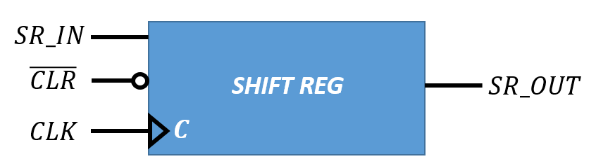
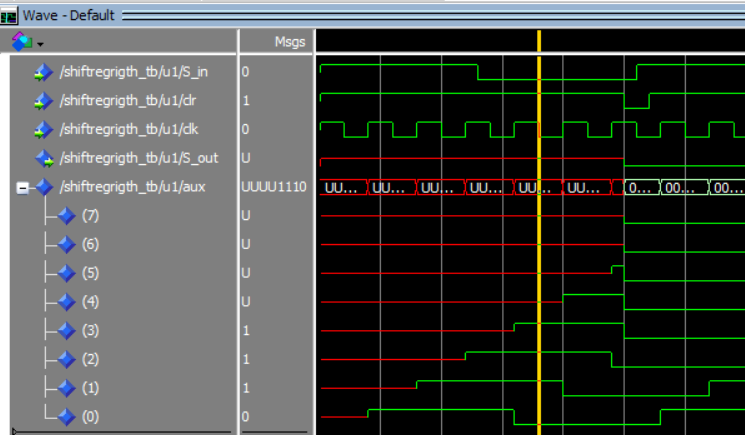
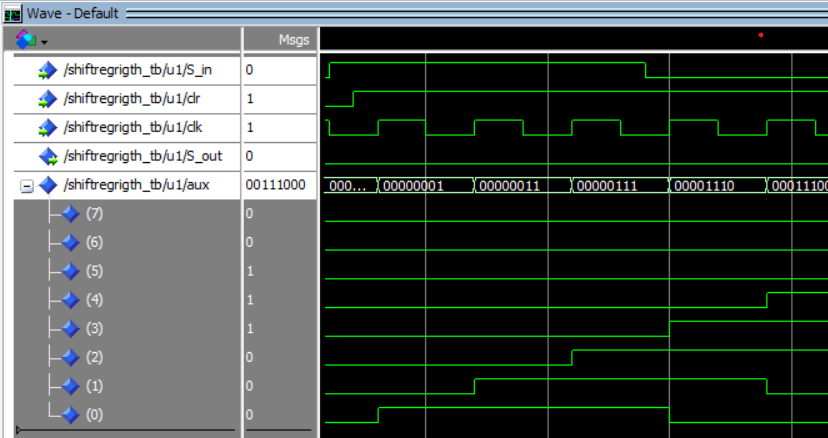

## **Descripción y funcionamiento de un registro de desplazamiento con entrada y salida serie de 8 bits.**

El registro de desplazamiento descrito es un registro con entrada serie, salida serie. Esto quiere decir que únicamente tiene una entrada y una salida. La Figura 1 muestra el símbolo de este componente.



El componente tiene una entrada de borrado (clr) activa en nivel bajo. Siendo esta entrada de asíncrona, es decir, el registro de desplazamiento se borrara inmediatamente cuando se aplique el nivel activo en esta entrada.

La código VHDL de la descripción del registro de desplazamiento es el siguiente:

```VHDL
library IEEE;
use IEEE.std_logic_1164.all;
use IEEE.numeric_std.all;

entity ShiftRegRigth is
    port(
        S_in,clr,clk : in     std_logic;
        S_out : out     std_logic:='0'
    );
end entity ShiftRegRigth;

architecture Behavioral of ShiftRegRigth is
    signal aux : std_logic_vector (7 downto 0);
begin

    shift: process(clk,clk)
    begin
        if (clr='0') then
            aux<=(others=>'0');
        elsif rising_edge(clk) then
            aux<= aux(6 downto 0) & S_in;
        end if;
    end process shift;
    S_out <= aux(7);
end architecture Behavioral;

```

De la descripción del código se pueden destacar los siguientes aspectos. El primero de ellos es el uso de la señal auxiliar como elemento de guardado de los datos durante el desplazamiento. Sin el uso de esta señal, esta descripción no sería posible. Es necesario almacenar 8 bits para poder construir el registro, aunque el almacenamiento sea interno y no tenga puerto de salida al exterior. (*signal aux : std_logic_vector (7 downto 0);*)

Otro punto a destacar es el uso de la instrucción ***rising_edge(clk)*** para la detección del flanco de reloj y el sincronismo con el flanco de subida del reloj, a diferencia de la implementación que se ha realizado en el [contador módulo 256](ContadorMod256.md) en el que se utiliza le expresión ***clk'event and clk = '1'***.


Como ocurre para toda descripción de circuito VHDL es necesario desarrollar el código de control de estimulos para la verificación del comportamiento. A continuación se muestra el ***Test Bench*** para la verificación del registro de desplazamiento.

```VHDL
library IEEE;
use IEEE.std_logic_1164.all;
use IEEE.numeric_std.all;

entity ShiftRegRigth_tb is
end entity ShiftRegRigth_tb;

architecture Behavioral of ShiftRegRigth_tb is
    
    component ShiftRegRigth is
        port(
            S_in,clr,clk : in     std_logic;
            S_out : out     std_logic:='0'
        );
    end component ShiftRegRigth;
    
    signal  S_in,clk,clr,S_out : STD_LOGIC;

--    signal  clr,S_out : STD_LOGIC;
--    signal  S_in : STD_LOGIC:='1';
--    signal  clk : STD_LOGIC:='0';

begin
    u1: ShiftRegRigth
    port map
    (
        S_in => S_in,
        S_out => S_out,
        clr => clr,
        clk => clk
    );
    
    -- clk <= NOT clk AFTER 2 ns;
    --S_in <= NOT S_in AFTER 13 ns;
    
    clr_process: process
    begin
        clr <= '1';
        wait for 25 ns;
        clr <= '0';
        wait for 2 ns;
        clr <= '1';
        wait;
    end process clr_process;

    S_in_process: process
    begin
        S_in <= '1';
        wait for 13 ns;
        S_in <= '0';
        wait for 13 ns;
    end process S_in_process;
    
    clk_process: process
    begin
        clk <= '1';
        wait for 2 ns;
        clk <= '0';
        wait for 2 ns;
    end process clk_process;
    
end architecture Behavioral;
```

Si nos fijamos en la descripción de los estimulos para el registro de desplazamiento, implementación difiere a la realizada para el resto de componentes descritos hasta el momento.

Además, se han dejado las instrucciones ***clk <= NOT clk AFTER 2 ns;*** y ***S_in <= NOT S_in AFTER 13 ns;*** comentadas ya que pueden utilizarse para la declaración de los estimulos de reloj y de la señal de entrada serie, respectivamente. Pueden utilizarse y funcionan de la misma manera que los procesos descritos en el siguiente bloque de código:

```VHDL
S_in_process: process
    begin
        S_in <= '1';
        wait for 13 ns;
        S_in <= '0';
        wait for 13 ns;
    end process S_in_process;
    
    clk_process: process
    begin
        clk <= '1';
        wait for 2 ns;
        clk <= '0';
        wait for 2 ns;
    end process clk_process;
```

Estos procesos son equivalentes a las instrucciones anteriormente mencionadas. Únicamente se pretende ilustrar que existen diferentes descripciones para resolver un mismo problema.

Tras simular el circuito obtenemos los resultados mostrados en la Figura 2. En esta Figura podemos ver que en los instantes iniciales tanto la salida *S_out* como los valores de la señal auxiliar presentan un valur *'U'*, es decir indeterminado. Esto se debe a que ni en la descripción, ni en el ***Test Bench*** hemos inicializado estos valores.

También vemos que nada más que se activa la señal de clear (*clr*) tanto los valores de la señal auxiliar (*aux*) como los valores de la salida *S_out* valen *'0'*, es decir, se inicializan en *'0'*.



Finalmente, la Figura 3 muestra el ejecto del desplazamiento, el cual se ve claramente reflejado en la señal auxiliar.



&copy; Diego Antolín Cañada
